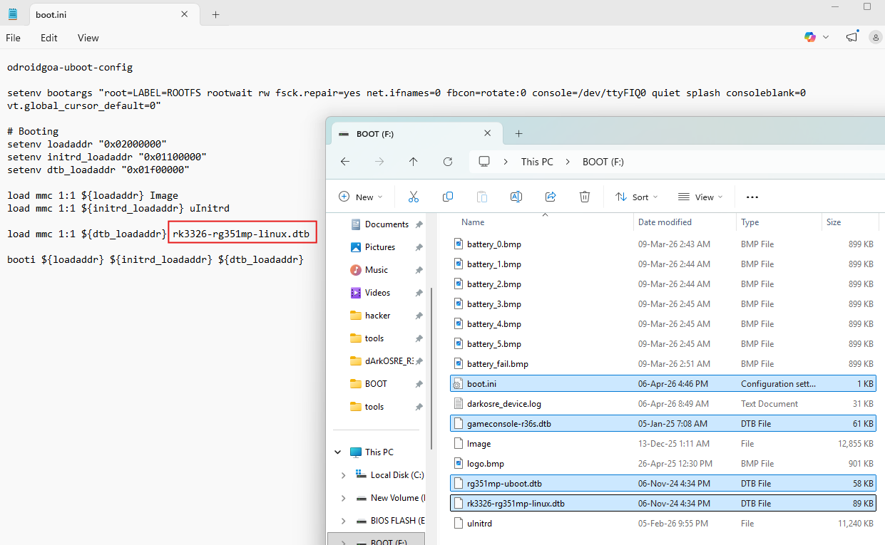
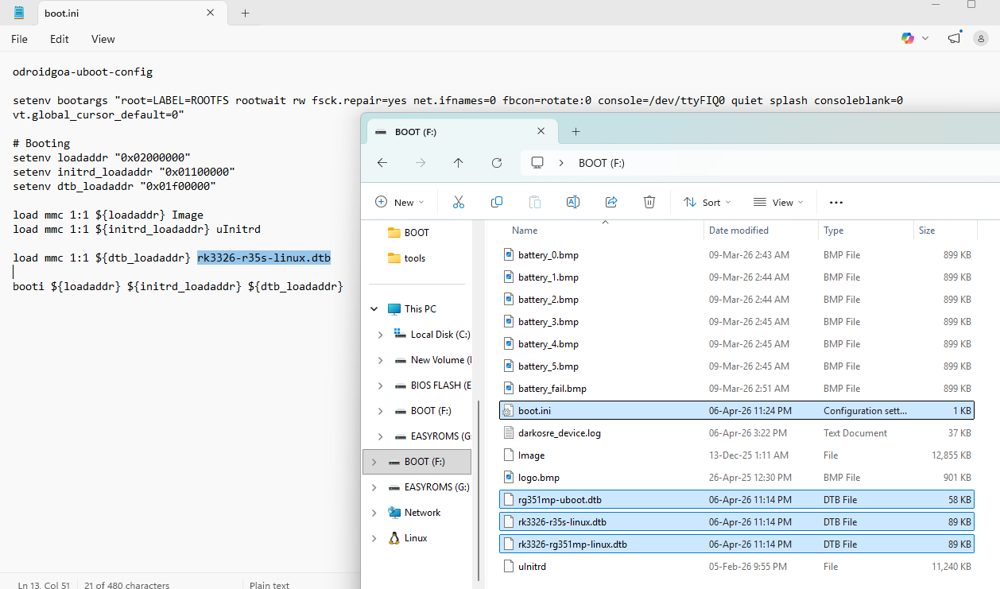
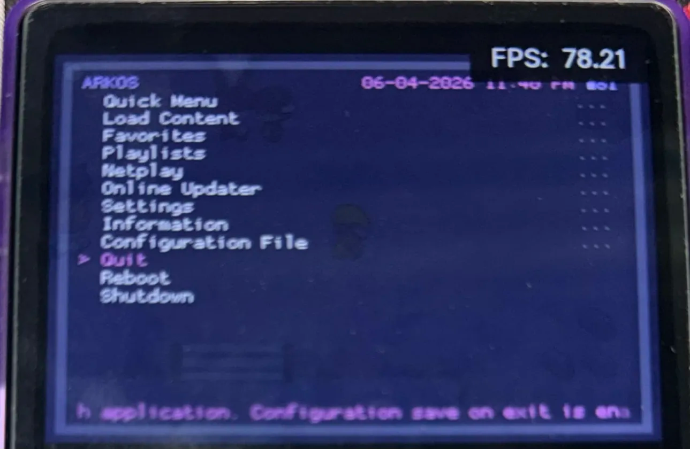
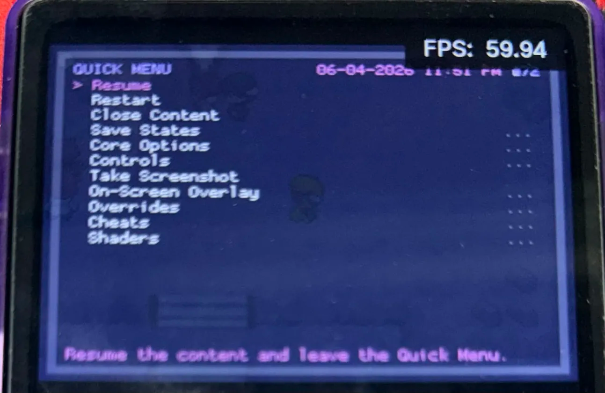

# darkosre-dtb-setup-reference

## Introduction
These are my setup steps for transitioning from ArkOS to dARKOSRE. I have R36S v21 (Panel 4).

## Steps and details - For BOOT-ArkOS-AEUX [Recommended as it uses 60hz]
1. Copy the R36S ArkOS-AEUX files - rk3326-r35s-linux.dtb, rk3326-rg351mp-linux.dtb, rg351mp-kernel.dtb
2. Paste it in the formatted dARKOSRE boot partition.
3. Update boot.ini to reference rk3326-r35s-linux.dtb. Do not reference rk3326-rg351mp-linux.dtb.
    - Change rk3326-r36s-linux.dtb to rk3326-r35s-linux.dtb
4. Rename rg351mp-kernel.dtb to rg351mp-uboot.dtb

## Steps and details - For BOOT-Factory (files that came straight from the factory) [Not recommended as it uses 77hz. Documentation purpose only]
1. Copy the R36S stock(ArkOS) files - gameconsole-r36s.dtb, rk3326-rg351mp-linux.dtb, rg351mp-kernel.dtb
2. Paste it in the formatted dARKOSRE boot partition.
3. Update boot.ini to reference rk3326-rg351mp-linux.dtb. Do not reference gameconsole-r36s.dtb directly.
    - Change rk3326-r36s-linux.dtb to rk3326-rg351mp-linux.dtb
4. Rename rg351mp-kernel.dtb to rg351mp-uboot.dtb

## Alternately
1. Copy over the files from this repository's respective BOOT folder over to the formatted dARKOSRE boot partition.

### BOOT-Factory

### BOOT-ArkOS-AEUX

## How to check refresh rate?
1. Launch a game, go into RetroArch menu and show framerates.

## 60hz vs 77hz
- https://www.reddit.com/r/R36S/comments/1dpit2l/comment/lamaa6m/
- https://www.reddit.com/r/R36S/comments/1i9oc9x/make_sure_you_do_this_if_you_have_r36s_v5_panel_4/
- https://www.reddit.com/r/R36S/comments/1caff1w/wrong_refresh_rate_new_display/

### Sample 77hz

### Sample 60hz

## Other Notes
[darkosre r36s-v21 2024-12-18 dtb](https://github.com/southoz/dArkOSRE-R36/tree/main/files/BOOT/dtb/r36s/R36S-V21%202024-12-18%202550) files runs in 77hz
